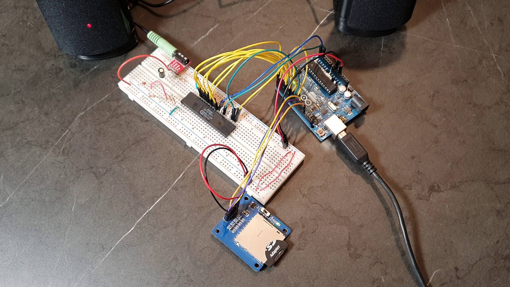
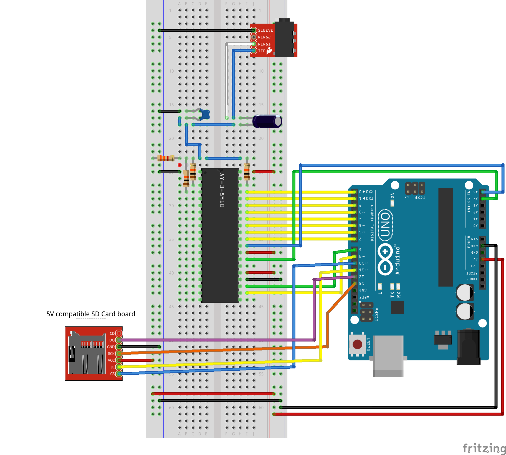

# Using an AY-3-8910 programmable sound generator with an Arduino

This repository holds the source code and schematics for the video https://www.youtube.com/watch?v=srmNbi9yQNU

Final schematic:

Arduino source code for the first test:

[AY-3-8910_test.ino](AY-3-8910_test.ino)

Arduino source code for the second test:

[AY-3-8910_sd_card.ino](AY-3-8910_sd_card.ino)

There is also an improved Arduino source code for the second test, where a buffer is used to store the bytes retrieved from the SD Card file and an interrupt on the Arduino's Timer 2 is used to improve timing when playing a song:

[AY-3-8910_sd_card_2.ino](AY-3-8910_sd_card_2.ino)

Python script to convert YM files to a custom file format SNG for the AY-3-8910:

[ymConverter.py](ymConverter.py)